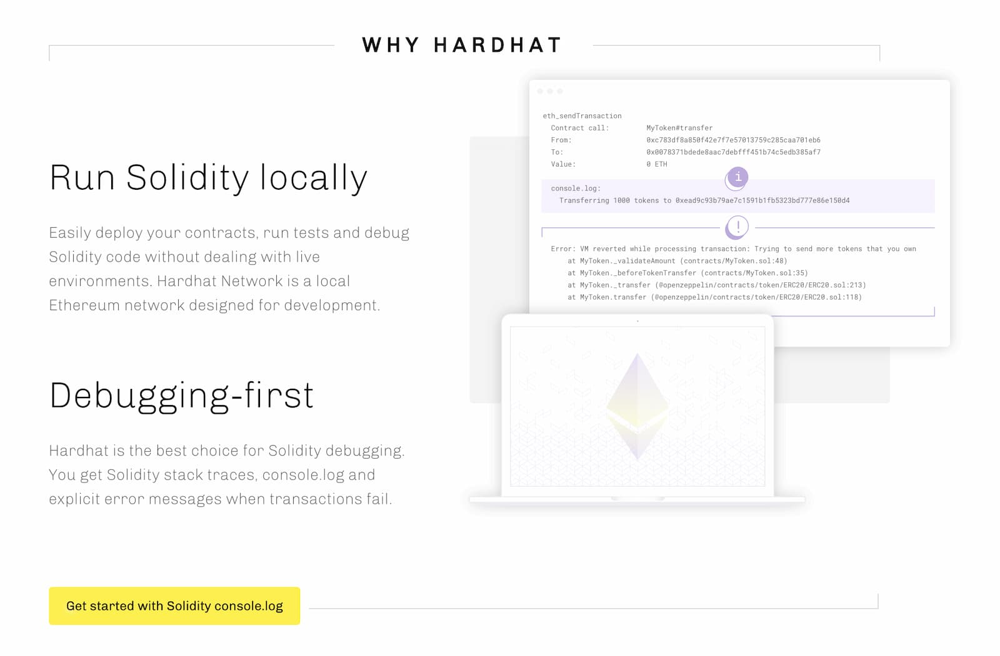
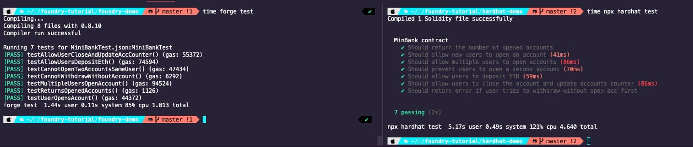

I've been using Hardhat since my first Solidity project. Back when I started learning solidity, I wasn't sold on the idea of working with an online IDE like [Remix](https://remix.ethereum.org/), and [Hardhat](https://hardhat.org/) was the most recommended option (although Truffle was close behind). After some months using it for almost all my solidity projects, I'm pretty used to it, how the different networks and project folders can be configured, how to write tests and I've even come up with an almost perfect (at least for me) project structure that I always use when I want to create a web 3 app.

A few weeks ago, one of my teammates talked to me about Foundry and performance was the main selling point. It really picked my curiosity so I decided to [install it](https://onbjerg.github.io/foundry-book/getting-started/installation.html) and [created a quick project](https://github.com/chainstack/foundry-vs-hardhat) to **compare the differences between Foundry and Hardhat building the same project.**

---

_We published [an article a few months ago](https://chainstack.com/foundry-a-fast-solidity-contract-development-toolkit/), where we explained how to install Foundry and gave a quick overview, so make sure to check it out first! By the way, if you get the error **Library not loaded: /usr/local/opt/libusb/lib/libusb-1.0.0.dylib** when creating your first project, just run `brew install libusb` to fix it (detailed [here](https://github.com/gakonst/foundry/discussions/481))_ 😉

---

## Project structure and configuration

After creating the project, Foundry generates a `foundry.toml` file. It's based on key-value pairs and serves as a configuration file similar to Hardhat's `hardhat.config.js` . In it, you can define the contracts source folder, where to output the compiled artifacts etc.

Here are the default folders with both:

| Files          | Foundry   | Hardhat       |
| -------------- | --------- | ------------- |
| Contract files | /src      | /contracts    |
| Test files     | /src/test | /test         |
| Output         | /out      | /artifacts    |
| Dependencies   | /lib      | /node_modules |

One of the main differences in the configuration file is that **in Hardhat you can add multiple networks, which can be used later on to deploy our contracts. In Foundry, that's currently not possible.** Most of the additional parameters that you can add to the `foundry.toml` file are related to the tests (verbosity, account, balance, gas price, etc). You can find more info about the [advanced config parameters here](https://onbjerg.github.io/foundry-book/reference/config.html).

The _remappings_ is one of the most important parameters and Foundry's config file and it's used to manage dependency imports. You can use remappings to create shortcuts and make imports less verbose in the contracts. You have to define a key-value pair in the remappings section of the `foundry.toml` file, where the value is the path to the contract folder you want to import. For example, you could create the following remapping:

```sh
remappings = ['ds-test/=lib/ds-test/src/',
# Shortcut to OpenZeppelin ERC20 token folder
 'openzeppelin-erc20/=lib/openzeppelin-contracts/contracts/token/ERC20/'
]
```

And then import the ERC20 token contract like this:

```js
// SPDX-License-Identifier: UNLICENSED

pragma solidity ^0.8.4;

// Default import
// import {ERC20} from "openzeppelin-contracts/contracts/token/ERC20/ERC20.sol";

// With remapping shortcut
import {ERC20} from "openzeppelin-erc20/ERC20.sol";

contract MyToken is ERC20 {
  // Contract code
}

```

You can see the difference with the default import commented two lines above.

## Dependencies

Hardhat uses NPM to manage dependencies, so if you're familiar with Node.js or Javascript projects, you'll know how it works. To install OpenZeppelin contracts, you'd run `npm install @openzeppelin/contracts` and you're good to go.

In Foundry, dependencies are installed with the `forge` CLI tool and are saved in the `lib` folder. Foundry uses Git submodules to handle dependencies which means you can **install as a dependency any repository** that has smart contracts, and they'll be included in a `.gitmodules` file instead of the `package.json` used in NPM projects.

To install a dependency you'll have to run `forge install GitHub-Organization-name/repository-name`. For example, if you want to install Openzeppelin smart contracts, you'll run `forge install OpenZeppelin/openzeppelin-contracts`. You can also install a specific branch or tag appending `@tag-name` to the dependency name.

After installing a dependency, you can run `forge remappings` and it'll print the remappings that Foundry will use by default. For example, after installing Openzeppelin contracts, this is what `forge remappings` return:

```sh
$ forge remappings
openzeppelin-contracts/=/Users/antonio/Chainstack/foundry-tutorial/foundry-demo/lib/openzeppelin-contracts/
ds-test/=/Users/antonio/Chainstack/foundry-tutorial/foundry-demo/lib/ds-test/src/
```

As mentioned earlier, you can create shortcuts by adding different remappings in the `foundry.toml` file or in a specific remappings.txt file.

## Logging

One of the things that improve the developer experience in Hardhat is using `console.log()`. Using `console.log()` is a very quick and popular way to debug and track errors in Javascript, and Hardhat provides a similar API out of the box, which is super useful. They even mention it as one of its selling points on their landing page!



Obviously, if you try to compile a contract that uses Hardhat's `console.log` with Foundry, you'll get an error as the dependency is not there. You could install it manually( via `forge install NomicFoundation/hardhat`) and import it (from [/hardhat-core/console.sol](https://github.com/NomicFoundation/hardhat/blob/master/packages/hardhat-core/console.sol)) but [the recommended option](https://github.com/gakonst/foundry/tree/master/forge#consolelog) is to copy [this contract](https://github.com/gakonst/foundry/blob/master/evm-adapters/testdata/console.sol) into your project, and import it wherever you want to use `console.log`. It's not ideal, but I'm sure they'll come up with a better option soon.

But **if you just need to write logs in your test files, you don't need any dependencies, at all.** The included-by-default [DSTest contract](https://github.com/dapphub/ds-test/blob/master/src/test.sol), comes with assertions and logging events so you just need to emit any of the available events, like `emit log_string()` or `emit log_int()`, `emit log_address()` etc.

## Writing Tests

**Testing is probably on the most different aspects between Hardhat and Foundry.** To compare them, I created **the same contract and tests with both Hardhat and Foundry**. The _MiniBank.sol_ contract I created, allows users to open accounts, deposit and withdraw ether, close the account, and return the number of active accounts. You can [find the code of both projects in the following repo](https://github.com/chainstack/foundry-vs-hardhat).

### Test files in Hardhat

In Hardhat, you write your tests in Javascript using the _describe_ and _it_ keywords to define all different scenarios, and use Mocha as the default assertion library. Using Hardhat, this would be part of the testing file for the MiniBank contract:

```js
const { expect } = require('chai')
const { ethers } = require('hardhat')

let miniBankFactory, miniBankContract, owner, user1, user2, user3

describe('MinBank contract', function () {
  beforeEach(async function () {
    miniBankFactory = await ethers.getContractFactory('MiniBank')
    ;[owner, user1, user2, user3] = await ethers.getSigners()
    miniBankContract = await miniBankFactory.deploy()
    await miniBankContract.deployed()
  })

  it('Should return the number of opened accounts', async function () {
    expect(await miniBankContract.accountsOpened()).to.equal(0)
  })
  it('Should allow multiple users to open accounts', async function () {
    await miniBankContract.connect(user1).openAccount()
    await miniBankContract.connect(user2).openAccount()
    await miniBankContract.connect(user3).openAccount()

    expect(await miniBankContract.accountsOpened()).to.equal(3)
  })

  it('Should prevent users to open a second account', async function () {
    await miniBankContract.connect(user1).openAccount()

    await expect(
      miniBankContract.connect(user1).openAccount()
    ).to.be.revertedWith('MiniBank: User has an account already!')
  })
  it('Should allow users to deposit ETH', async () => {
    await miniBankContract.connect(user1).openAccount()

    await miniBankContract.connect(user1).deposit({ value: 1 })
    expect(await miniBankContract.connect(user1).checkBalance()).to.equal(1)
  })
})
```

If you're a Javascript developer this is probably familiar. You can separate blocks of tests with `describe()` and define each test with a very descriptive name with `it()`.In addition, if you're just starting your journey into Web3, Solidity, and smart contracts, you just need to learn how to handle a few new assertions, like `revertedWith`, but smart contract tests are very similar to any other Javascript tests.

### Test files in Foundry

**In Foundry, tests are smart contracts written in Solidity** that inherit from the _DSTest_ contract. Each test is a function named _testSomeScenarioToTest_ and all available assertions are inherited from the _DSTest_ contract as well, which [you can find here](https://github.com/dapphub/ds-test/blob/master/src/test.sol).

Following the recommended convention, for the `MiniBank.sol` contract, the test file will be named `/src/test/MiniBank.t.sol` and it would look like this:

```js
// SPDX-License-Identifier: UNLICENSED
pragma solidity 0.8.10;

import "ds-test/test.sol";
import "../MiniBank.sol";

// required for expect revert and other cheats
interface Vm {
    // to assert returned contract errors
    function expectRevert(bytes calldata) external;

    // to change user interacting with the contract
    function prank(address) external;
}

contract MiniBankTest is DSTest {
    MiniBank minibank;
    // required for expect revert and other cheats
    // HEVM_ADDRESS is 0x7109709ECfa91a80626fF3989D68f67F5b1DD12D);
    Vm vm = Vm(HEVM_ADDRESS);

    function setUp() public {
        minibank = new MiniBank();
    }

    function testReturnsOpenedAccounts() public {
        assertEq(0, minibank.accountsOpened());
    }

    function testUserOpensAcount() public {
        minibank.openAccount();
        assertEq(1, minibank.accountsOpened());
    }
     function testMultipleUsersOpenAccount() public {
        minibank.openAccount();
        // injects change of user
        vm.prank(address(1));
        minibank.openAccount();
        vm.prank(address(2));
        minibank.openAccount();

        assertEq(3, minibank.accountsOpened());
    }
    function testAllowUsersDepositEth() public {
        minibank.openAccount();
        minibank.deposit{value: 1 ether}();
        assertEq(1 ether, minibank.checkBalance());
    }

}

```

There's a lot going on here so let's review the basics:

- The test contract inherits from `DSTest`.
- We have to import the contract we want to test and instantiate it inside the`setUp()` method, which is similar to the `beforeEach` in Javascript tests.
- Each test is a public function whose name starts with _test_ or _testFail_.
- Inside each test, we can call the contract methods using the contract instance created in the `setUp()`.
- To send ETH to a contract method, you have to use `contract.methodName{value: 1 ether}();`

You're probably wondering what is that Vm interface? Well, that's used for Foundry's cheats and it requires its own section in this article 😉

### Understanding Foundry cheats for testing

**Cheatcodes are an important part of Foundry's testing tools** and are used for things like changing the date or number of the current block, forcing the next contract call to be made from a different account, or asserting specific reverts or events. You can [find all the list of all available cheat methods in their GitHub repo](https://github.com/gakonst/foundry/tree/master/forge#cheat-codes).

Coming from Hardhat, understanding cheats was a little complex but once you get your head around them, you realize how useful they are.

To use these cheat codes, first, we need to create an interface and define all the cheat methods we want to use (you can find [the available cheat codes here](https://github.com/gakonst/foundry/tree/master/forge#cheat-codes)). In the example above it was this part:

```js
// required for expect revert and other cheats
interface Vm {
  // to assert returned contract errors
  function expectRevert(bytes calldata) external;
  // to change user interacting with the contract
  function prank(address) external;
}

```

After that, we need to create a state variable that uses that interface as its type like this:

```js
// HEVM_ADDRESS is 0x7109709ECfa91a80626fF3989D68f67F5b1DD12D);
Vm vm = Vm(HEVM_ADDRESS);
```

**But what is that HEVM_ADDRESS?** It's a pre-defined contract address that contains all the cheat methods. Here's how they explain it in the docs:

> cheats are invoked by calling specific functions on a specially designated address: 0x7109709ECfa91a80626fF3989D68f67F5b1DD12D. If you are using ds-test, then this address is assigned in a constant named HEVM_ADDRESS.

Once we have declared an instance of the cheats contract, we can use it in our tests like this:

```js

 function testMultipleUsersOpenAccount() public {
        minibank.openAccount();
        // injects change of user
        vm.prank(address(1));
        minibank.openAccount();
        // injects change of user
      vm.prank(address(2));
        minibank.openAccount();

        assertEq(3, minibank.accountsOpened());
    }

    function testCannotOpenTwoAccountsSameUser() public {
        minibank.openAccount();
        // injects assertion
        vm.expectRevert("MiniBank: User has an account already!");
        minibank.openAccount();
    }

```

Changing the user with `vm.prank()` or the current block with `vm.roll()` before calling a contract method is easy to understand as you're changing the user or the status of the blockchain right before actually calling the contract method itself, but `vm.expectRevert()` is weird. It's like doing the assertion before actually calling the method 😵‍💫 But once you get your head around that, cheats are pretty cool and easy to use.

On the other hand, writing tests in solidity means not having to deal with so many `async/await` methods, which means writing less code.

> `vm.expectRevert()` is weird. It's like doing the assertion before actually calling the method 😵‍💫

### Running tests: performance difference

**When it comes to running the tests, the first thing I noticed was how fast Foundry was.** I've used the same contract with the same number of tests and same scenarios, the only difference was that I wrote the tests for the Hardhat project in Javascript while I wrote them in Solidity for Foundry.

I removed the cache folders in both projects before measuring how long it took to compile the contract and run the project, and the difference was huge:

1.44secs vs 5.17secs

**Foundry took 1.44 seconds to compile the contract and run all the tests, while Hardhat took 5.17 seconds.** Keeping the cache folders, the difference is huge as well: Foundry took 0.45 seconds (almost instant), while Hardhat took 3.98 seconds.

In a small project like this, the difference may not be that important but in bigger projects, it can make a difference.

I also wanted to try compiling a larger project, so I cloned [GEB](https://github.com/reflexer-labs/geb), which has 26 smart contracts. I had to reorganize the project files and install all the dependencies but I was able to time how long it took to compile all the contracts in both cases. **With Hardhat, it took 14.56 seconds and with Foundry, it took 8.53 seconds 💨**

### Tests in Foundry: pros and cons

Here is a list of what I consider the **pros and cons of writing tests with Foundry vs Hardhat:**

| Pros                      | Cons                                                                        | Neither                   |
| ------------------------- | --------------------------------------------------------------------------- | ------------------------- |
| No async/await            | Test names not as descriptive as in JS tests                                | tests written in solidity |
| Tests require fewer code  | Cheats are difficult to understand at first                                 |
| Tests run super fast      | `expectRevert` assertion is weird                                           |
| Auto-generated gas report | `testFail` only tests if the test fails, not if the error is what we expect |

## Deploying contracts

One of the aspects I like about Hardhat is that you can write deployment scripts in Javascript and target different networks, or use the `dotenv` package to load the RPC endpoints and private keys from environment variables. It makes deployments easy to write and share.

In Foundry, deployments are run from the CLI like this: `forge create --rpc-url <your_rpc_url> --private-key <your_private_key> src/MyContract.sol:MyContract` which is not ideal. And if you need to pass some arguments to the contract's constructor, this gets completly out of hand: `forge create --rpc-url <your_rpc_url> --constructor-args "MyToken" "MTKN" 18 1000000000000000000000 --private-key <your_private_key> src/MyToken.sol:MyToken`.

I asked about a more convenient approach to this in the Foundry Telegram channel and they recommended creating a bash script. I even found [a GitHub repo](https://github.com/smartcontractkit/foundry-starter-kit) (credits to [Patrick Collins](https://twitter.com/PatrickAlphaC)) with some step-by-step scripts to make the deployment a little bit easier.
In addition, **[the team is working on new ways to deploy contracts](https://github.com/gakonst/foundry/issues/402#issuecomment-1022530001)** and even make deployments available in the tests in order to, for example, run some tests against a contract after it's being deployed.

It sounds great and I'm sure the team will have something more convenient really soon.

## Cast CLI tool

Foundry includes the `cast` CLI tool which allows you to interact with the blockchain or a smart contract. You'd need an RPC endpoint to run most commands so make sure to [sign up in Chainstack and get your rpc endpoint for free](https://console.chainstack.com/user/account/create).

In summary, you can query the blockchain by block, get information about wallets and call any smart contract methods.

For example, if you wanted to call the `balanceOf(address)` method of the USDC ERC20 token contract ( which address address is 0xA0b86991c6218b36c1d19D4a2e9Eb0cE3606eB48), you'll run: `$ cast call "balanceOf(address)(uint256)" "0x123456...." --rpc-url https://my-rpc-endpoint/abcdef`.

It's a useful tool and pretty fast as well but, similar to deploying contracts, it requires creating bash scripts to avoid writing super long commands.

You can find [all the available methods here](https://onbjerg.github.io/foundry-book/reference/cast.html).

### Final thoughts

Foundry is not 100% complete but it's evolving and it looks promising. Performance is awesome, there is a great and very active community around the project and [their Telegram channel](https://t.me/foundry_rs) is filled with discussions about new features and how to make it a better development tool.

I've seen some people mention that they use Foundry to develop the contracts and write the tests, and at the same time use Hardhat for scripting and deployments. This can be a good option while the team releases a new way to deploy contracts.

If you're want to give it a try, make sure to join [the Foundry Telegram channel](https://t.me/foundry_rs), [the support channel](https://t.me/foundry_support), read the [Foundry book to learn how to start using it](https://onbjerg.github.io/foundry-book/), and keep an eye on [the public GitHub repository](https://github.com/gakonst/foundry).

## Summary of differences

|           | Foundry         | Hardhat          |
| -------------------------- | --------------------------------- | -------------------------------------- |
| Installation                                             | via CLI curl command                                                                        | not required with NPX, or via NPM                                                   |
| CLI tools                                                | **forge** to manage the project (build/compile) & **cast** to interact with smart contracts | **hardhat** manage the project (build/compile/run scripts)                          |
| Build & test performance                                 | 💨💨💨💨💨                                                                                  | 🐢🐢                                                                                |
| Configuration file                                       | `foundry.toml`                                                                              | `hardhat.config.js`                                                                 |
| Allows project folder configuration                      | Yes, in `foundry.toml` file                                                                 | Yes, in `hardhat.config.js` file                                                    |
| Dependency management                                    | GitHub submodules (any repository)                                                          | NPM packages                                                                        |
| Dependencies file                                        | .gitmodules                                                                                 | package.json                                                                        |     |     |
| Files included in sample project                         | empty smart contract and basic test                                                         | Greeter smart contract (with set/get methods), test files and script to run locally |
| Test file format                                         | Solidity contracts                                                                          | JavaScript test files                                                               |
| Test assertion library (default)                         | ds-test                                                                                     | Mocha                                                                               |
| Allows to alter blockchain status (time, block) in tests | Yes via cheatcodes                                                                          | Limited, via mainnet forking.                                                       |
| Allows run specific tests?                               | Yes via --match-test --match-contract                                                       | Yes via "only" or "skip" in test files                                              |
| Contract deployments                                     | Via forge CLI or Bash scripts (new solutions in progress)                                   | Via JS scripts                                                                      |
| Blockchain / contracts interaction                       | via Cast CLI tool                                                                           | N/A                                                                                 |
