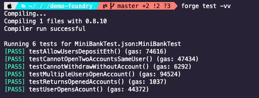

Installation is pretty simple although is via CLI with [instructions here](https://onbjerg.github.io/foundry-book/getting-started/installation.html)

To scaffold a new projet run `forge init my-project-name`. I got the following error:

```sh

forge init demo                          ABRT ✘
dyld: Library not loaded: /usr/local/opt/libusb/lib/libusb-1.0.0.dylib
  Referenced from: /Users/antonio/.foundry/bin/forge
  Reason: image not found
[1]    41994 abort      forge init demo
```

Found [this gitHub issue](https://github.com/gakonst/foundry/discussions/481) with a fix, just install the required library with `brew install libusb`. After that, `forge init` worked just fine.

## Project structure

After creating the project, Foundry generates a `foundry.toml` file, which is similart to Hardhat's `hardhat.config.js`. In it, you can define the contract source folder, where to output the compiled artifacts etc.

The remappings is one of the most important things we can configure here and it's used to manage dependency imports.

## Dependencies

Hardhat uses NPM to manage dependencies, which all its pros and cons. If you're familiar with Node.js or Javascript projects, you'll know how it works.

In Foundry, dependencies are installed with `forge install`, which saves them in the `lib` folder. Foundry uses Git submodules to handle dependencies which means you can **install as a dependency any repository** that has smart contracts. To install a dependency you'll have to run `forge install GitHub-Organization-name/repository-name`. For example, if you want to install Openzeppelin smart contracts, you'll to run `forge install OpenZeppelin/openzeppelin-contracts`.

We can also install a specific branch or tag appending `@tag-name` to the dependency name.

After installing a dependency, we can run `forge remappings` and it'll print the remappings that foundry will use by default. For example, after installing Openzeppelin contracts, this is what `forge remappings` returns:

```sh
forge remappings
openzeppelin-contracts/=/Users/antonio/Chainstack/foundry-tutorial/demo-foundry/lib/openzeppelin-contracts/
ds-test/=/Users/antonio/Chainstack/foundry-tutorial/demo-foundry/lib/ds-test/src/
```

This means that I could use imports in my own contracts like this:

```js
// SPDX-License-Identifier: UNLICENSED
pragma solidity 0.8.10;

// openzeppelin-contracts remapping points to /lib/openzeppelin-contracts/ inside my project folder by default
import {ERC20} from "openzeppelin-contracts/contracts/token/ERC20/ERC20.sol";

contract Contract is ERC20 {
    constructor() ERC20("MyToken", "MTKN") {
        // mints 1 million tokens
        _mint(msg.sender, 1000000 * (10**uint256(18)));
    }
}

```

## Logging

One of the tricky things coming from Hardhat is using `console.log()`.

With Hardhat, you can import this contract library that provides methods to print in the terminal which is super useful. But obviously, if you try to compile a Hardhat contract that uses the `console.log`, you 'll get an error as the dependency is not there. You could install it as a dependency (which you can do via `forge install NomicFoundation/hardhat` and import it from [_/packages/hardhat-core/console.sol_](https://github.com/NomicFoundation/hardhat/blob/master/packages/hardhat-core/console.sol)) but [the recommended option](https://github.com/gakonst/foundry/tree/master/forge#consolelog) is to copy [this contract](https://github.com/gakonst/foundry/blob/master/evm-adapters/testdata/console.sol) into your project, and import it wherever you want to use `console.log`. It's not ideal, but they'll come up with a better option soon.

**If you just need to write logs in your test files, you don't need any dependencies.** The included-by-default [DSTest contract](https://github.com/dapphub/ds-test/blob/master/src/test.sol), comes with assertions and logging events so you just need to emit any of the available events, like `emit log_string()` or `emit log_int()`, `emit log_address()` etc.

## Hardhat vs Foundry: Writting Tests

Testing is probably on the the most different aspects between Hardhat and Foundry. To compare them, I created a basic smart contract that simulates a bank and allow users to open accounts, deposit and withdraw ether, close the account, and return the number of active accounts. You can [find the code here]().

In Hardhat, you write your tests in Javascript using the _describe_ and _it_ keywords to define all different scenarios, and use Mocha as the default assertion library. Using Hardhat, this would be a testing file for the MiniBank contract:

```js
const { expect } = require('chai')
const { ethers } = require('hardhat')

let miniBankFactory, miniBankContract, owner, user1, user2, user3

describe('MinBank contract', function () {
  beforeEach(async function () {
    miniBankFactory = await ethers.getContractFactory('MiniBank')
    ;[owner, user1, user2, user3] = await ethers.getSigners()
    miniBankContract = await miniBankFactory.deploy()
    await miniBankContract.deployed()
  })

  it('Should return the number of opened accounts', async function () {
    expect(await miniBankContract.accountsOpened()).to.equal(0)
  })
})
```

If you're Javascript developer this is probably familiar. You can separate blocks of tests with `describe()` and define each test witha a very descriptive name with `it()`.

If you're starting your journey into Web3, Solidity and smart contracts, you just need to learn how to handle a few new assertions, like `revertedWith`, but smart contract tests are very similar to any other Javascript tests.

---

**In Foundry however, tests are smart contracts written in Solidity** that inherit from the _DSTest_ contract, and each test is a function named _testSomeScenarioToTest_. All available assertions are inherited from the DSTest contract as well, which [you can find here](https://github.com/dapphub/ds-test/blob/master/src/test.sol).

Following the convention, for the `MiniBank.sol` contract, the test file will be named `MiniBank.t.sol` and it would look like this written in Solidity:

```js
// SPDX-License-Identifier: UNLICENSED
pragma solidity 0.8.10;

import "ds-test/test.sol";
import "../MiniBank.sol";

// required for expect revert and other cheats
interface Vm {
    function expectRevert(bytes calldata) external;

}

contract MiniBankTest is DSTest {
    MiniBank minibank;
    // required for expect revert and other cheats
    Vm vm = Vm(0x7109709ECfa91a80626fF3989D68f67F5b1DD12D);

}

```

There's a lot going on here so let's review the basics:

- The test contract inherits from DSTest
- We have to import the contract we want to test and instantiate it inside the`setUp()` method., which is similar to the `beforeEach` in Javascript tests.
- Each test is a public function which name starts with _test_ or _testFail_.
- Inside each test, we can call the contract methods using the contract instance created in the `setUp()`.
- To send ETH to a contract method, you have to use `contract.methodName{value: 1 ether}();`

You're probably wondering what is that Vm interface? Well that's used for Foundry's cheats and it requires its own section in this article 😉

### Understanding Foundry cheats for testing

Cheats are an important part of Foundry's testing tools and are used for things like changing the date or number of the current block, forcing the next contract call to be made from a different account or to assert specific reverts or events. You can [find all the list of all available cheat methods in their GitHub repo](https://github.com/gakonst/foundry/tree/master/forge#cheat-codes).

Coming from Hardhat, understanding cheats was a little complex but once you get your head around them, you realise how useful they are.

To use these cheatcodes, first, we need to create an interface and define all the cheat methods we want to use. In the example above it was this part:

```js
// required for expect revert and other cheats
interface Vm {
    // to assert returned contract errors
    function expectRevert(bytes calldata) external;
    // to change user interacting with the contract
    function prank(address) external;
}

```

Second, we need to create a state variable that uses that interface as its type like this:

```js
// HEVM_ADDRESS is 0x7109709ECfa91a80626fF3989D68f67F5b1DD12D);
    Vm vm = Vm(HEVM_ADDRESS);
```

But what is that HEVM_ADDRESS? It's a pre-defined contract address that contains all the cheat methods. Here's how they explain it in the docs:

> cheats are invoked by calling specific functions on a specially designated address: 0x7109709ECfa91a80626fF3989D68f67F5b1DD12D. If you are using ds-test, then this address is assigned in a constant named HEVM_ADDRESS.

Once we have an instance of the cheats contract available, we can use it in our tests like this:

```js

 function testMultipleUsersOpenAccount() public {
        minibank.openAccount();
        // injects change of user
        vm.prank(address(1));
        minibank.openAccount();
        // injects change of user
      vm.prank(address(2));
        minibank.openAccount();

        assertEq(3, minibank.accountsOpened());
    }

    function testCannotOpenTwoAccountsSameUser() public {
        minibank.openAccount();
        // injects assertion
        vm.expectRevert("MiniBank: User has an account already!");
        minibank.openAccount();
    }

```

Changing the user with `vm.prank()` or the current block with `vm.roll()` before calling a contract method is easy to understand as you're changing the status of the blockchain or the user, but `vm.expectRevert()` is weird. It's like doing the assertion before actually calling the method 😵‍💫 But once you get your head around that, cheats are pretty cool and easy to use.

On the other hand, writing tests in solidity means not having to deal with so many `async/await` methods.

> `vm.expectRevert()` is weird. It's like doing the assertion before actually calling the method 😵‍💫

Here is a list of what I consider pros and cons writing tests with Foundry:

| Pros                      | Cons                                                                        | Neither                  |
| ------------------------- | --------------------------------------------------------------------------- | ------------------------ |
| No async/await            | Test names not as descriptive as in JS tests                                | tests writen in solidity |
| Tests require less code   | Cheats are difficult to understand at first                                 |
| Tests run super fast      | `expectRevert` assertion is weird                                           |
| Auto-generated gas report | `testFail` only tests if the test fails, not if the error is what we expect |

### Running tests


Tests print out the gas used 👌

### Compile

To compile, run `forge build`

## All differences

|                                     | Foundry                                                                                     | Hardhat                                                                             |
| ----------------------------------- | ------------------------------------------------------------------------------------------- | ----------------------------------------------------------------------------------- |
| Installation                        | via CLI curl command                                                                        | via NPM or not required with NPX                                                    |
| CLI tools                           | **forge** to manage the project (build/compile) & **cast** to interact with smart contracts | **hardhat** manage the project (build/compile)                                      |
| Configuration file                  | foundry.toml                                                                                | hardhat.config.js                                                                   |
| Allows project folder configuration | Yes, in foundry.toml file                                                                   | Yes, in hardhat.config.js file                                                      |
| Dependency management               | GitHub submodules (any repository)                                                          | NPM packages                                                                        |
| Dependency configuration            | remappings allowed in foundry.toml or remappings.txt file                                   | N/A                                                                                 |
| Files included in sample project    | empty smart contract and basic test                                                         | Greeter smart contract (with set/get methods), test files and script to run locally |
| Test files                          | Solidity contracts                                                                          | JavaScript test files                                                               |
| Test assertion library (default)    | ds-test                                                                                     | Mocha                                                                               |
| Allows run specific tests?          | Yes via --match-test --match-contract                                                       | Yes via "only" or "skip" in test files                                              |
